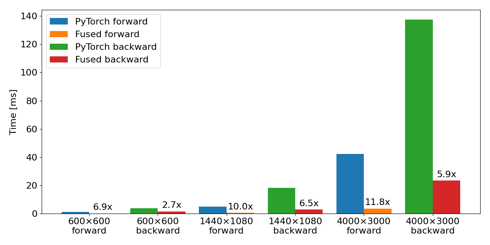
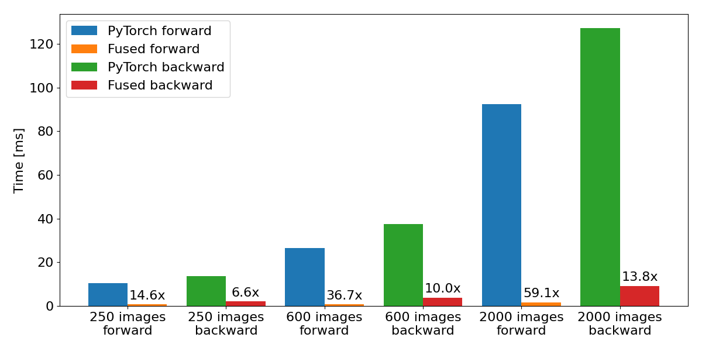
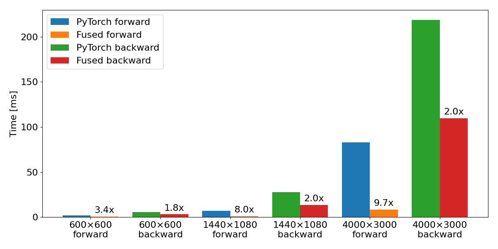

# Fully Fused Differentiable Bilateral Grid

Fused bilateral grid inspired by [fused-ssim](https://github.com/rahul-goel/fused-ssim) and its forks.

Bilateral grid introduced in the paper *Bilateral Guided Radiance Field Processing* (https://bilarfpro.github.io/) has shown to improve visual quality of radiance fields significantly, especially in the presense of exposure changes during capture. But it comes with performance bottleneck.

This implementation is intended to be compatible with [Nerfstudio's fork of original bilateral grid](https://github.com/nerfstudio-project/nerfstudio/blob/5003d0e2711d9231908d81bc0e0b7823f96889b0/nerfstudio/model_components/lib_bilagrid.py). Currently, it implements the class `BilateralGrid` and accelerates functions `slice` and `total_variation_loss`, which are used in training in Nerfstudio's `splatfacto` method. More features may be added in the future, and contributions are welcome.


## Quick Start

To install, use the following command (tested on Ubuntu 22.04, PyTorch 2.1.2+cu118):

```bash
git clone https://github.com/harry7557558/fused-bilagrid.git
cd fused-bilagrid
pip install . --no-build-isolation
```

To use in Nerfstudio, instead of:

```py
from nerfstudio.model_components.lib_bilagrid import BilateralGrid, slice, total_variation_loss

bil_grids = BilateralGrid(num_train_data)

grid_y, grid_x = torch.meshgrid(
    torch.linspace(0, 1.0, H, device=self.device),
    torch.linspace(0, 1.0, W, device=self.device),
    indexing="ij",
)
xy = torch.stack([grid_x, grid_y], dim=-1).unsqueeze(0)

out = slice(bil_grids, xy, rgb, idx)

tv_loss = total_variation_loss(bil_grids.grids)
```

Do this:

```py
from fused_bilagrid import BilateralGrid, slice, total_variation_loss

bil_grids = BilateralGrid(num_train_data)

out = slice(bil_grids, None, rgb, idx)

tv_loss = total_variation_loss(bil_grids.grids)
```

If `xy` is not provided, the implementation assumes the above `xy`. You can optionally provide `xy`, and the function will work for irregular `xy` and is differentiable to all real inputs, but there may be performance drop compared to a default `xy` &ndash; still multiple times faster compared to PyTorch implementation, see benchmark below.


## Benchmark

Benchmark below is performed on my laptop with an RTX 4070, with default `[16, 16, 8]` grid resolution. See `tests/profile.py` for details.

### `slice` with default `xy`, batch size `1`:



### `total_variation_loss`:



### `slice` with random `xy`, batch size `1`:



### Overall training:

When training `splatfacto` with bilateral grid on one dataset with around 800 1080x1440 images, `fused_bilagrid` reduces total training time by **3.5 times** compared to `nerfstudio.model_components.lib_bilagrid`.

I'm not an expert in GPU programming, so it's likely that the implementation is still far from optimal. You are welcome to suggest changes via issue/PR and create forks of the project.


## Consistency with PyTorch implementation

Bilateral grid sampling involves bilinear interpolation, which is C0 continuous and therefore involves undefined gradient. This happens with default `xy` for some image resolutions. This implementation detects such discontinuity and sets gradient to zero, while PyTorch appears to assign an arbitrary value. This difference does not practically affect radiance field training.

For image resolutions that don't fall on discontinuity, relative error with PyTorch implementation is typically well below `1e-5`, but may be noisy due to stochastic nature of `atomicAdd`.
